1. First install Foundry tool kit.

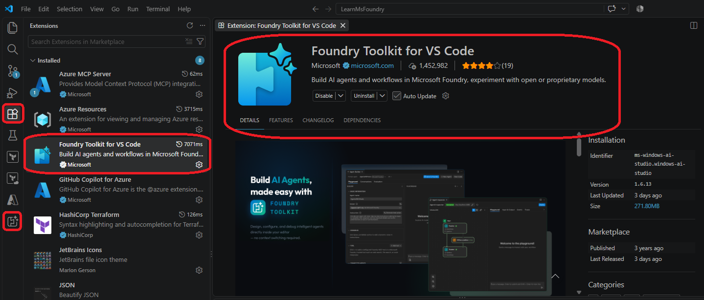

2. Install Prerequisites

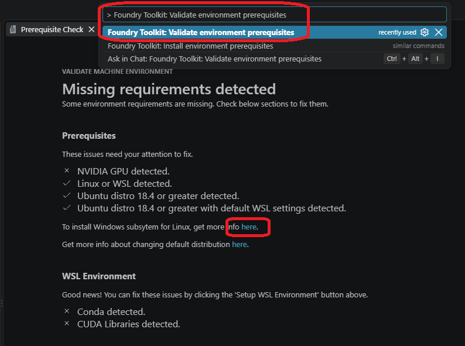

3. Once the prerequisites are set up, then start the foundry tool kit internface by clicking the following icon. Then expand Help and Feedback and click Ask Copilot

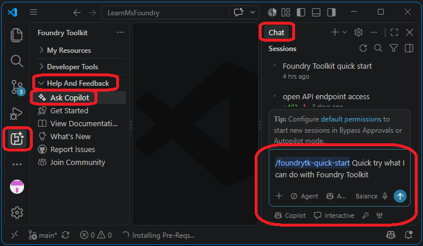

4. Select set up foundry

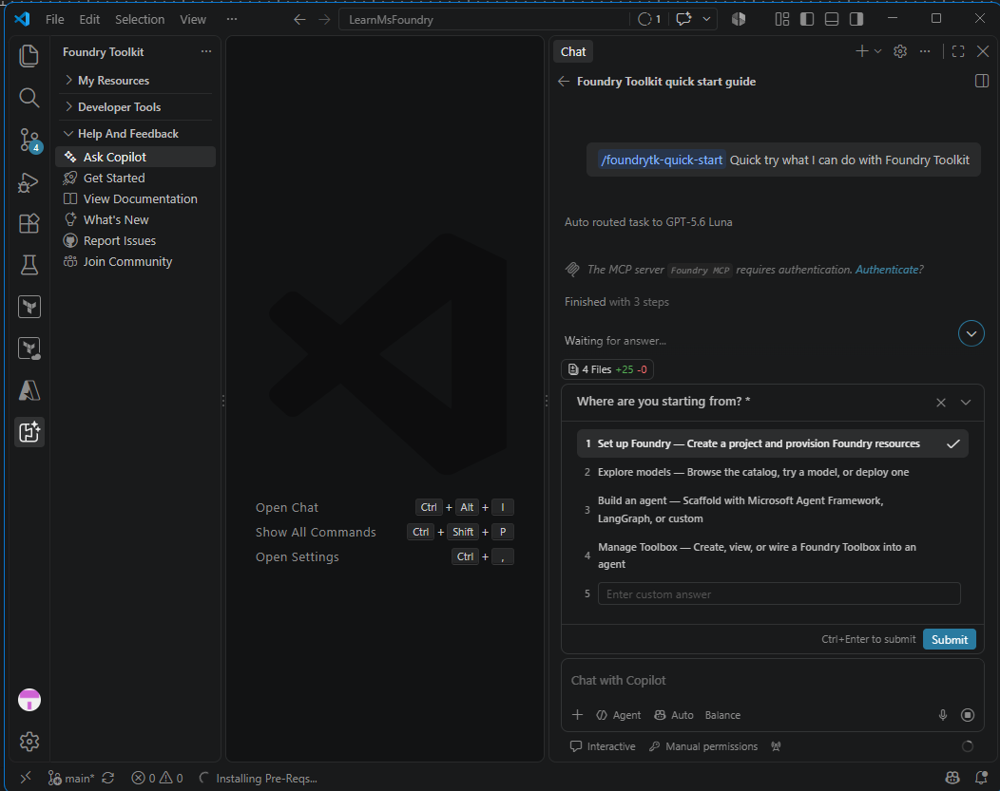

5. Tell copilot if you have a subscription.

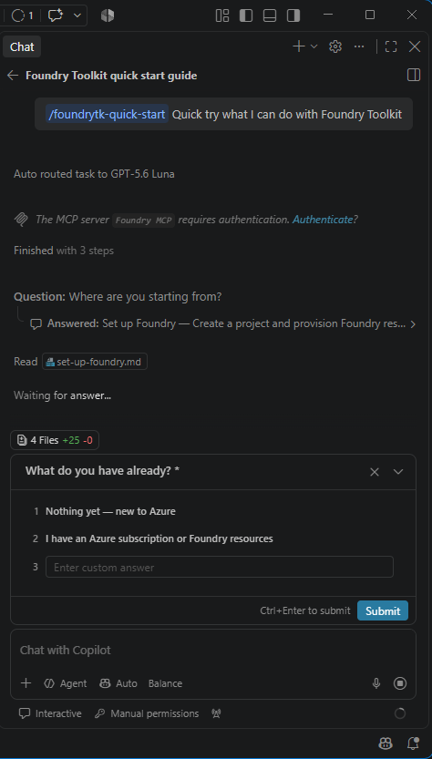

6. Follow the instructions to start creating the project. 

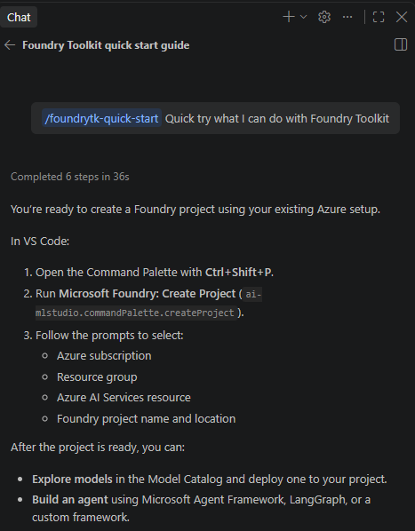

7. From the command palette create project.

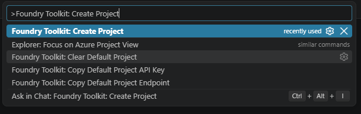

8. Select subscription

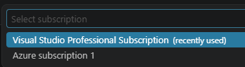

9. Create or choose resource group

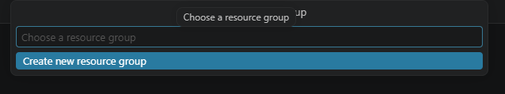

10. Give a name to resource group

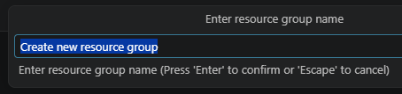

11. Choose a location

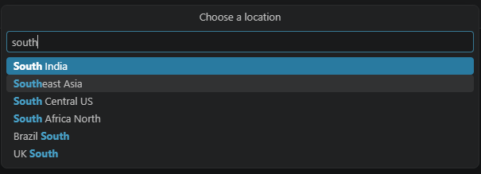

12. Now create project name

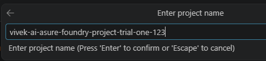

13. Project creation happening

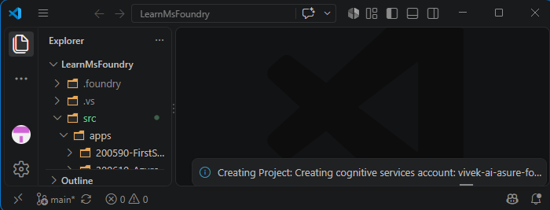

14. Deploy model

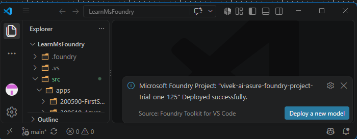

# Ref
1. https://code.visualstudio.com/docs/intelligentapps/overview#_install-and-setup

2. https://code.visualstudio.com/docs/intelligentapps/overview#_verifying-and-installing-foundry-toolkit-pre-requisites-local-models

3. https://learn.microsoft.com/en-us/windows/wsl/install

4. [Your Entire Agentic AI Workflow Now Inside VS Code](https://www.youtube.com/watch?v=aQFSDGAk9DA)

5. The [full playlist](https://www.youtube.com/playlist?list=PLJfWOmd-Usr4) 

