The copilot says

I don't have a direct command-execution tool available in this session to launch the Model Catalog UI for you automatically, but here's how you can open it yourself:

1. Open the Command Palette in VS Code (`Ctrl+Shift+P`).

2. Run Foundry Toolkit / AI Toolkit: Models (this maps to command `ai-mlstudio.models`).

3. In the catalog, filter by provider "Microsoft Foundry", then search for `gpt-4o` and `gpt-4o-mini` to compare their vision capabilities, benchmarks, and pricing side by side.

In the Visual Studio Code Github Copilot Chat put the following text.

Recommend two models I should compare for a marketing scenario, with image input support, available in Foundry Toolkit, and deployable in my Azure subscription(Visual Studio Professional Subscription) and my Azure region(South India)

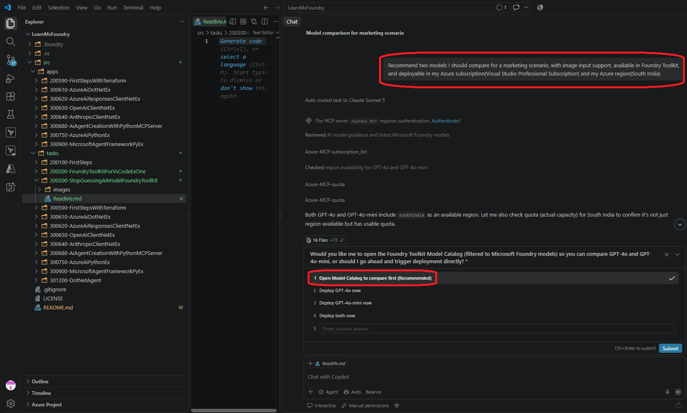

Here is more info about the same.

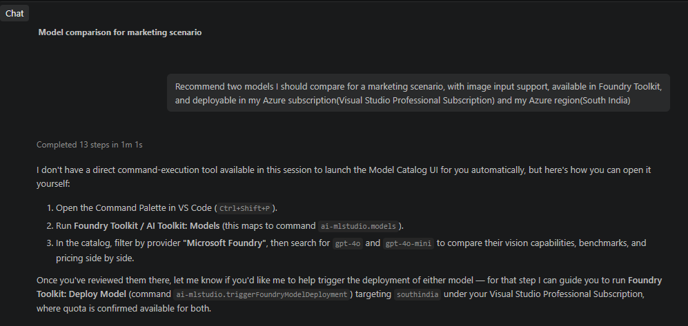

You can open the model catelog using the following command in the command palette. 

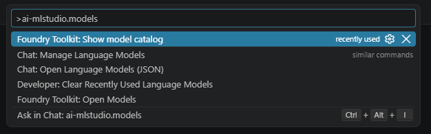

If you feel there is something is disabled, like Foundry or models not showing properly, then it could be that the VPN is not allowing proper connections, so disable VPN.

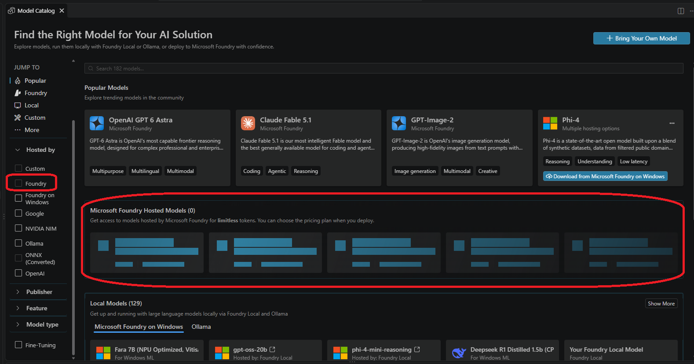

Disabling VPN shows everything, so you can filter as follows. In the Hosted by filter Foundry, for the publisher choose OpenAI and so on.

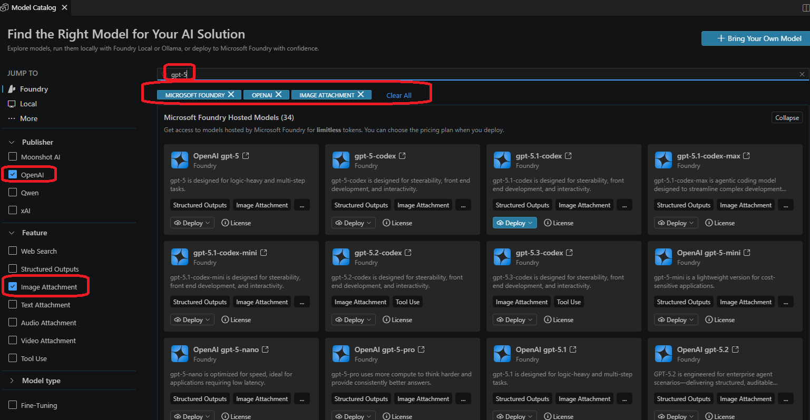

After the filter choose some model and observe the deploy button. It has a down arrow, press it. You can see Deploy with default settings and Custom deploy

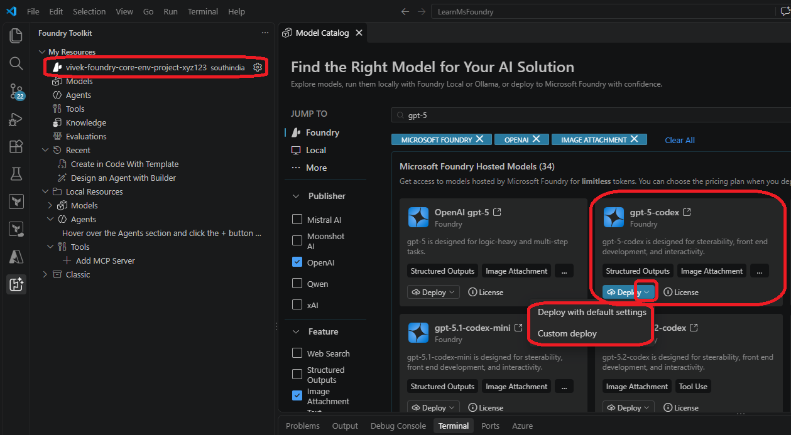

Once deployed, you can see it Ap.Azure portal.

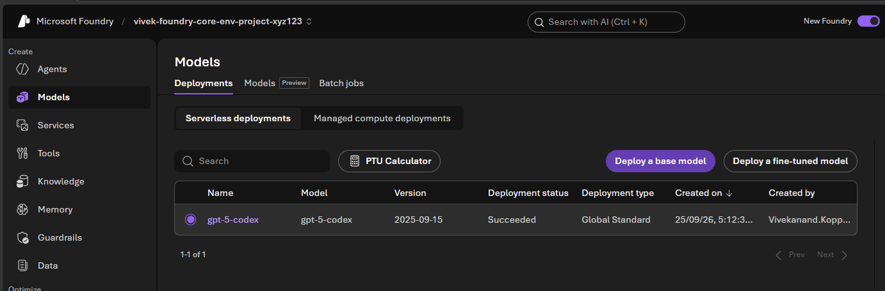

If you choose custom deploy, you can change some parameters as follows.

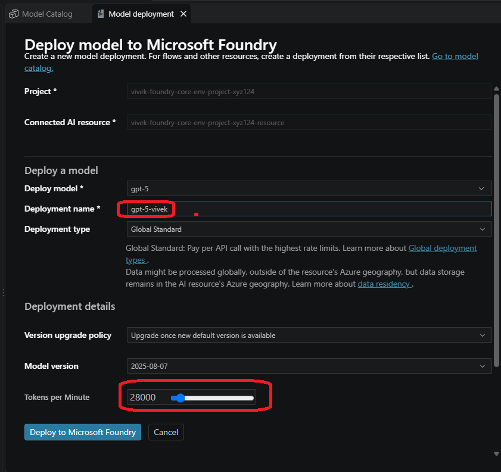

You can deploy multiple models. And view them as follows.

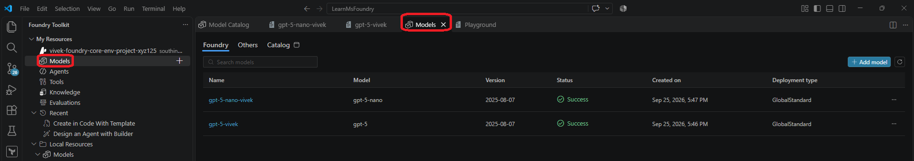

In the above, click any of the model, and you can enter the playground. Now in the playground, you can compare.

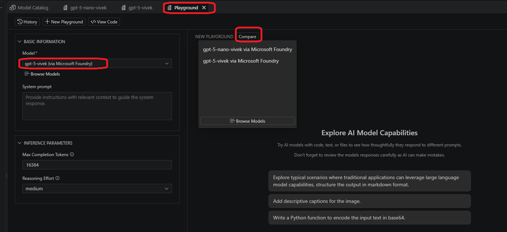

Once in compare mode in the playground, you can ask same question to multiple models like the follows.

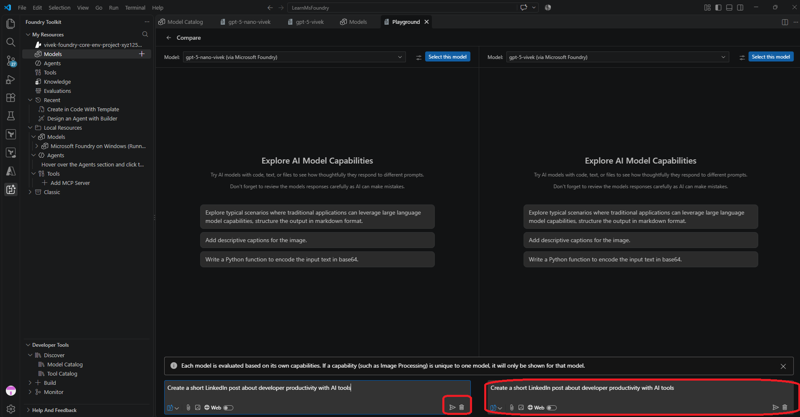

Depending on the model, you can get response as follows.

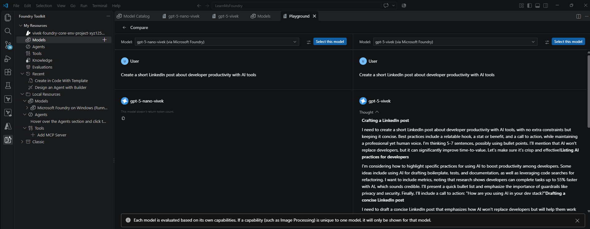

With a different set of models, it looks as follws.

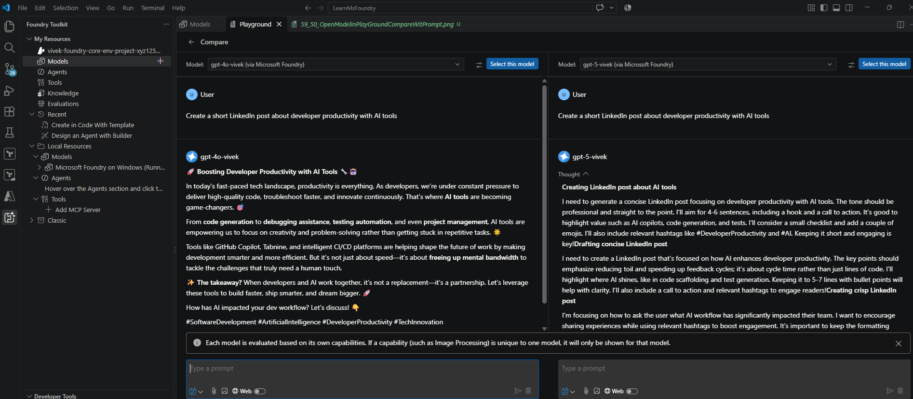

The following is a sample image you can use for some query.

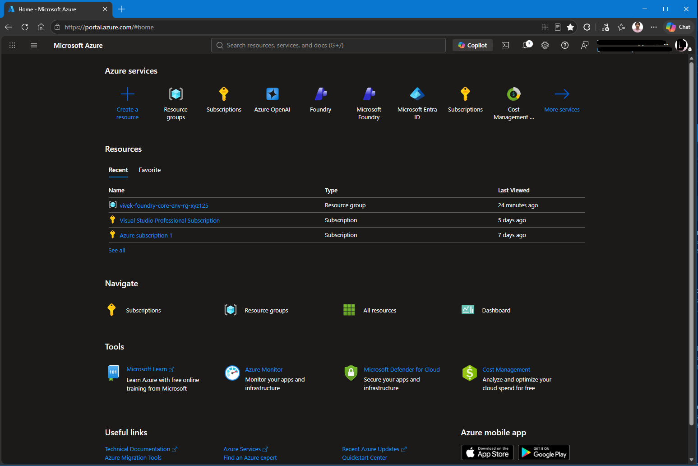

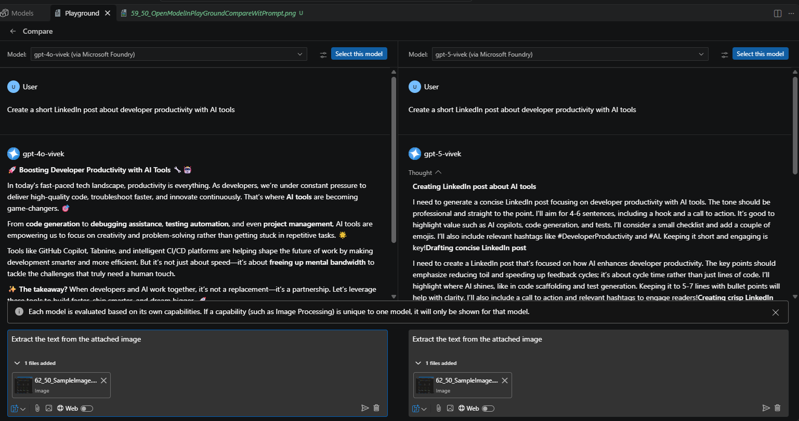

You can attach image into the prompt as follows.

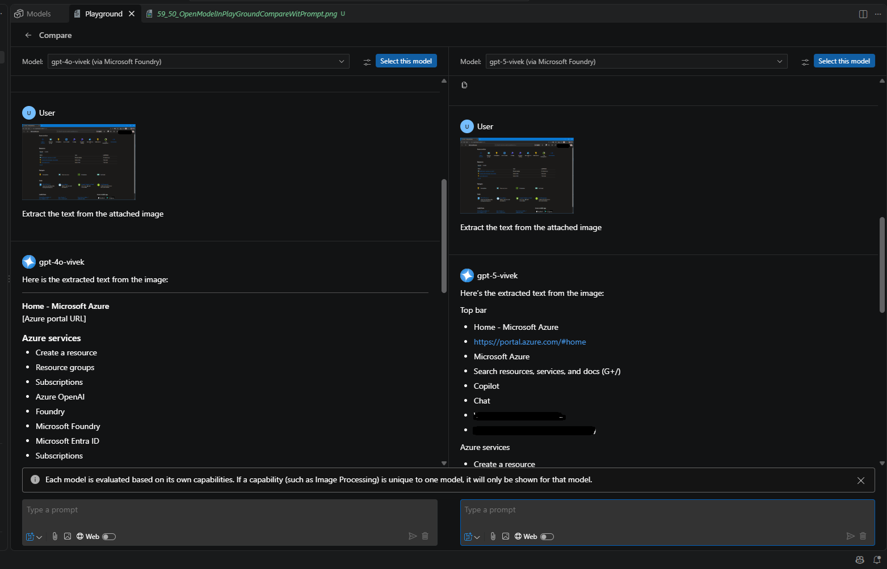

Then finally, you can use the playground with a single model. You can use the prompt as follows.

You are an intelligent and friendly AI assistant that supports a social media management team creating content targeted to a developer audience, on different channels and formats. 

Your role is to :
- Engage with users in natual conversation to understand their social  media content creation goals

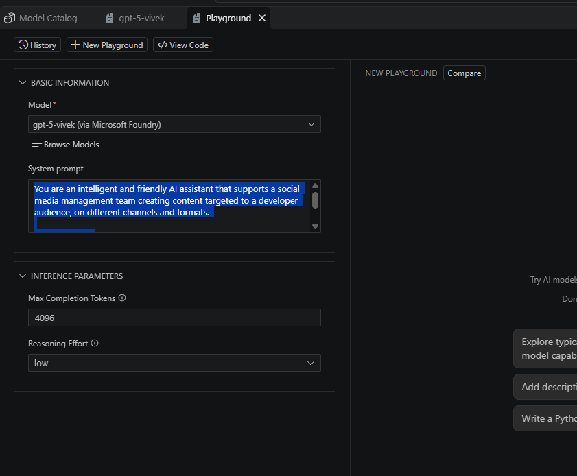

