# The following are the steps.

1. Visit https://ai.azure.com/home. Then click Start Building.

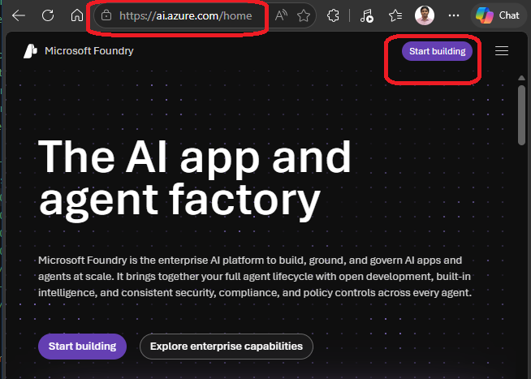

2. Login to Azure. In this case its SSO login

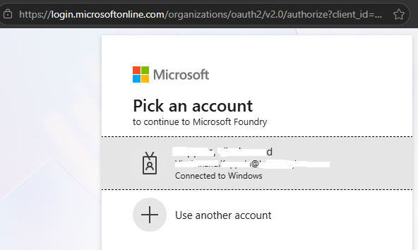

3. After login.

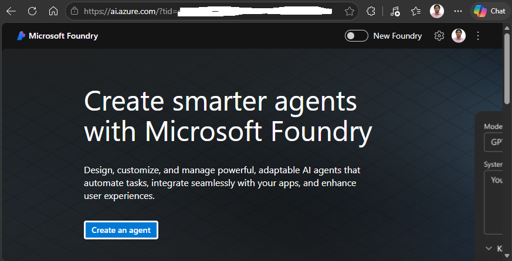

4. If you want to sign out, do the following.

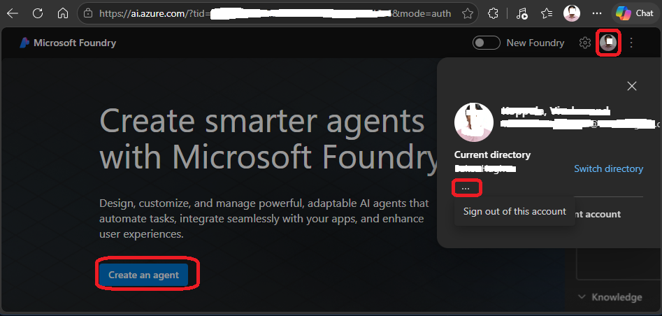

5. To Start, click create an agent.

6. Or you can click New Foundary

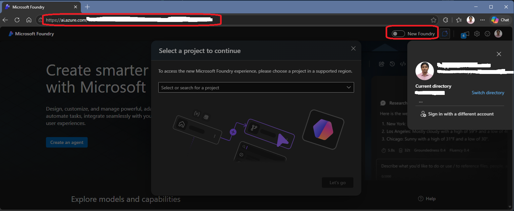

7. If you select new foundry, then select new project.

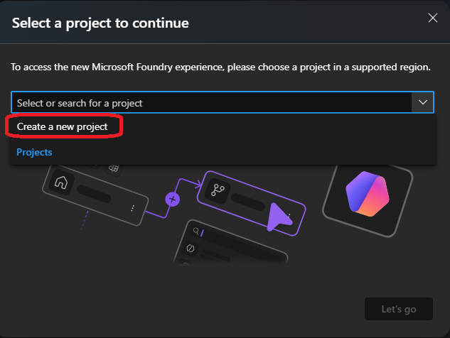

8. Fill up the details as follows.

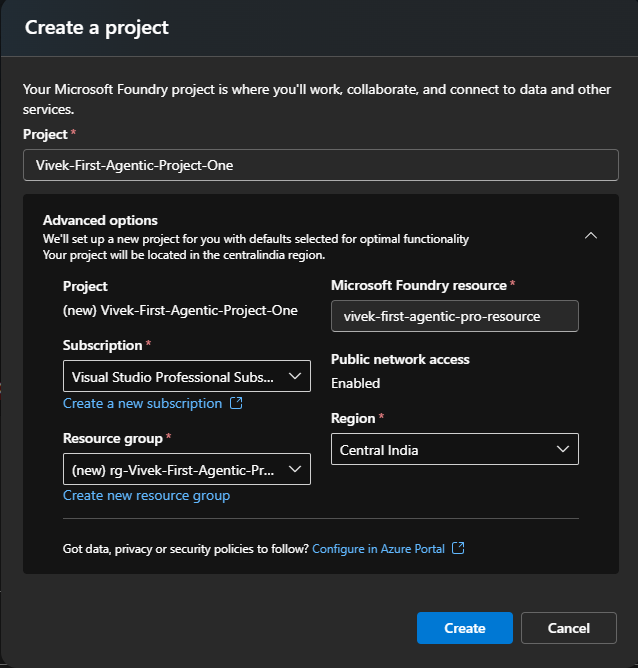

9. I am creatng Vivek-First-Agentjic-Project-One

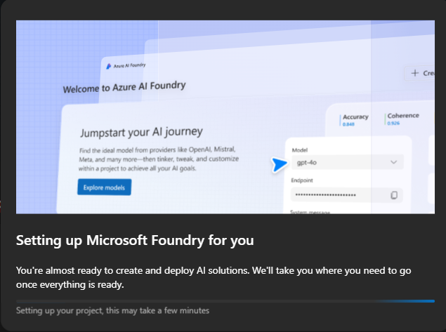

10. After the project is created

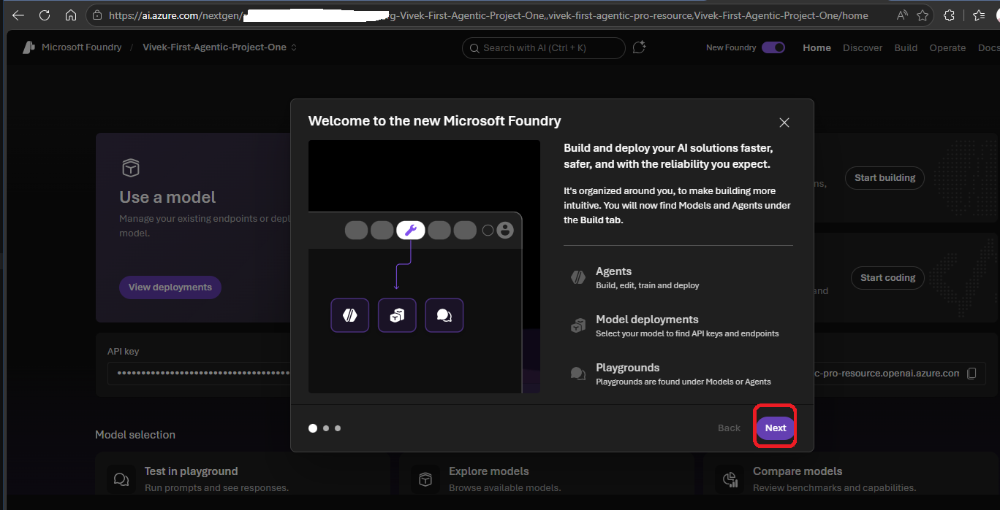

11. You can see the api keys etc are here.

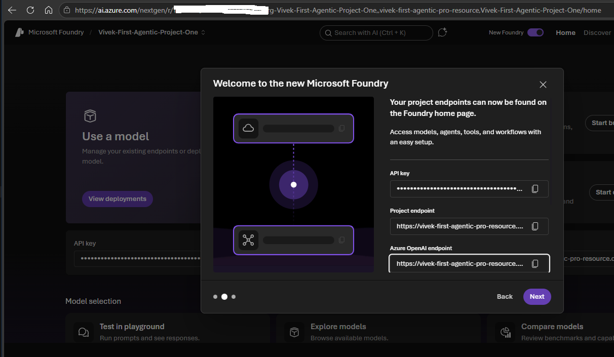

12. Finally create project

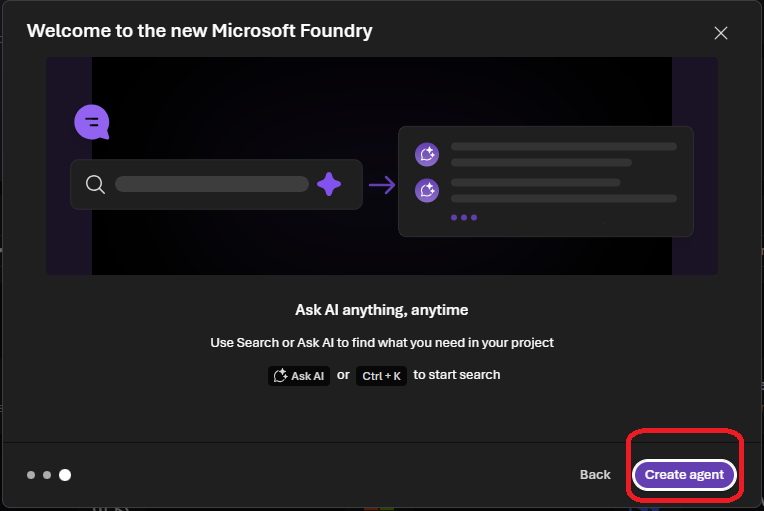

13. You may get the error as follows.

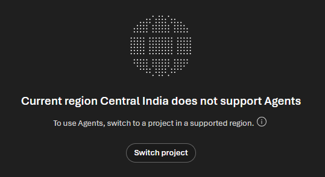

14. This time, I see the following 

14. I tried differently as follows with differetn name and location

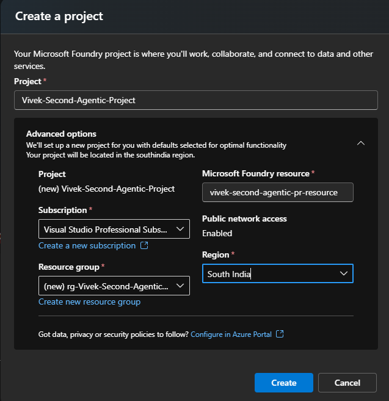

15. Provide the agent a name.

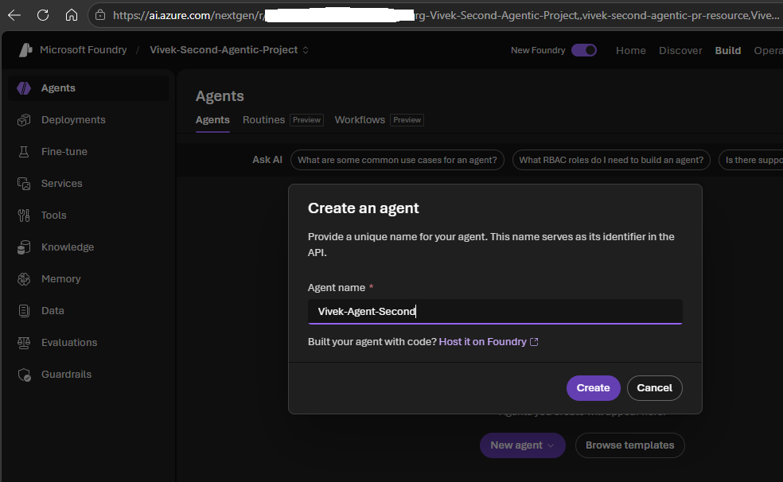

16. On the portal, it looks as follows.

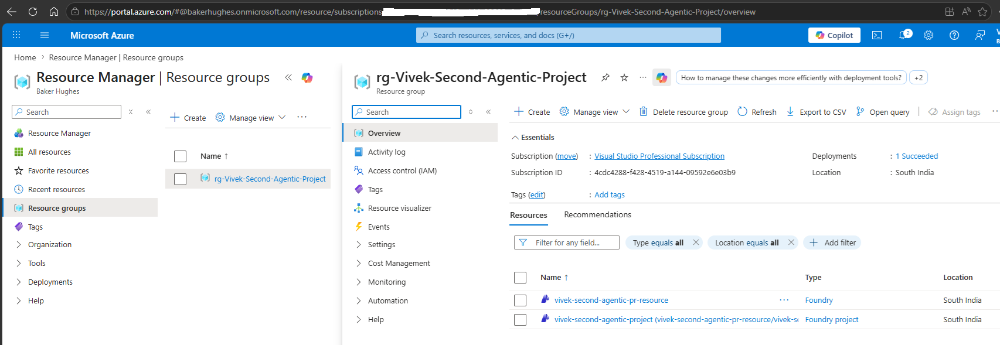

17. On Ai.Azure portal, it looks as follows.

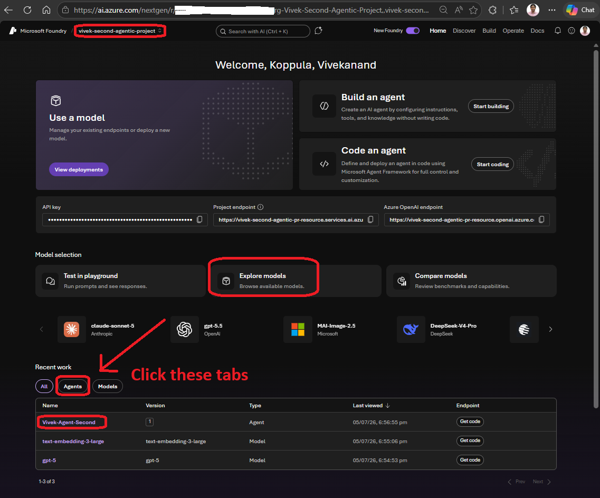

18. After the project creation is complete, the next step is to deploy a model inside a project. Click Explore Models to start exploring the models.

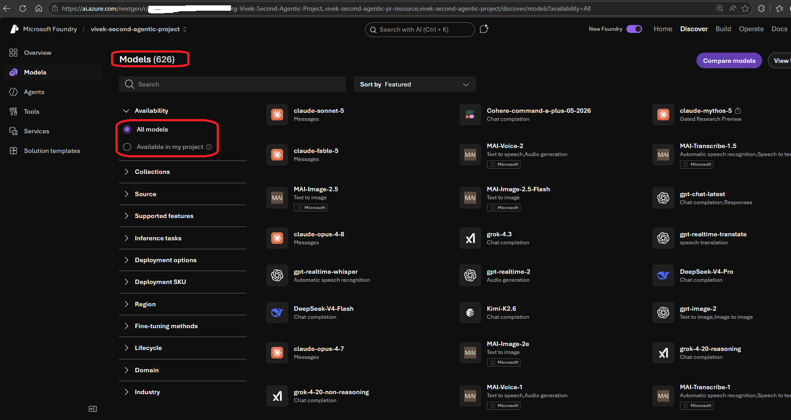

19. Model Filters 

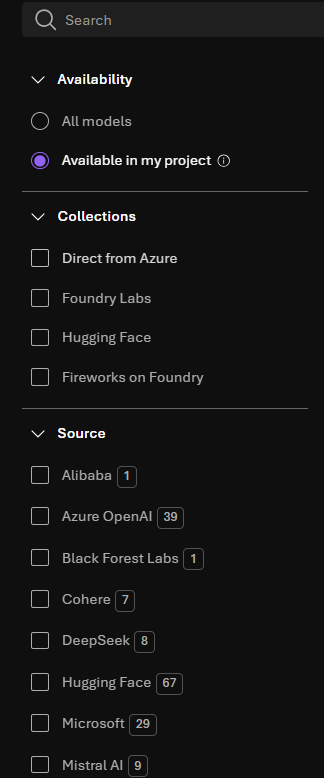

20. On the top right, there is View LeaderBoard and Compare Models buttons. The leaderboard helps unders how models rank with each other. Select Gpt5.4 mini

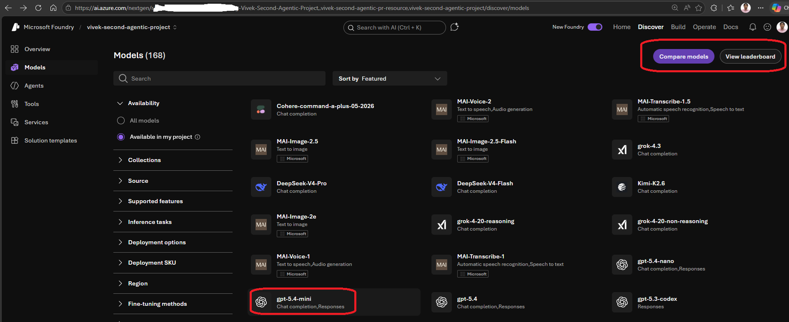

21. At this point, you can go to home, and click View Deployments.

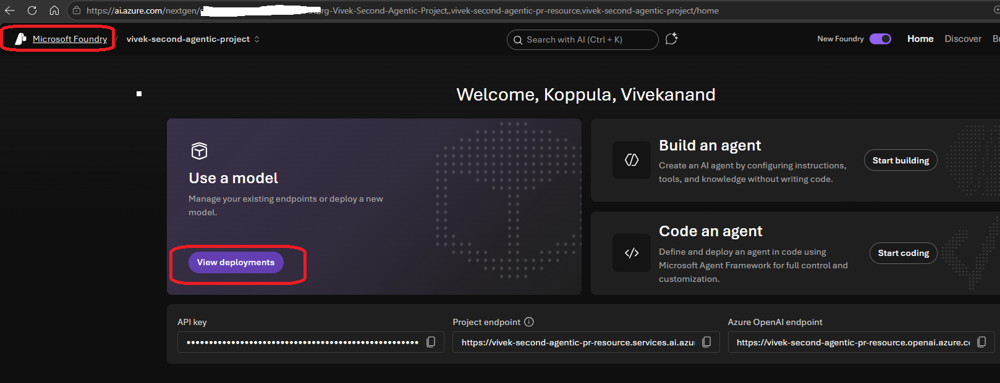

22. View Deployments from vertical tab

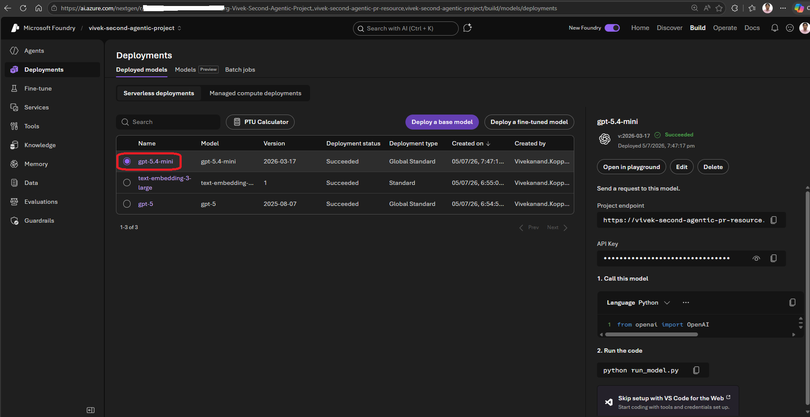

23. Save as agent. Now at this point, you are no longer experimenting with an model, you are creating an agent.

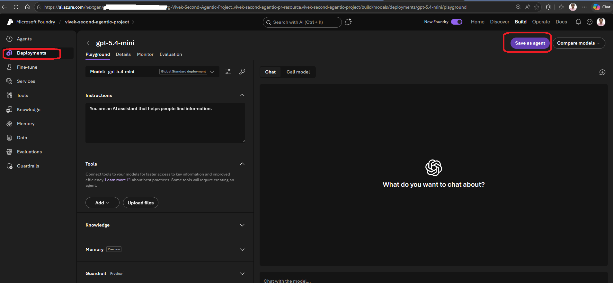

24. 

https://portal.azure.com/auth/login/

https://my.visualstudio.com/benefits

https://ai.azure.com/

