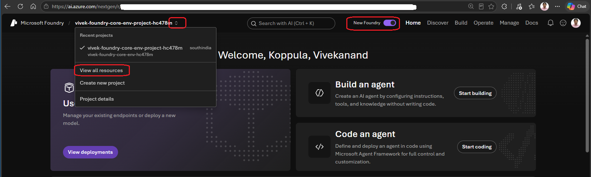
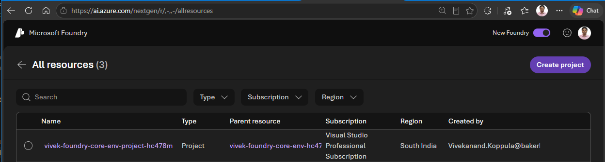
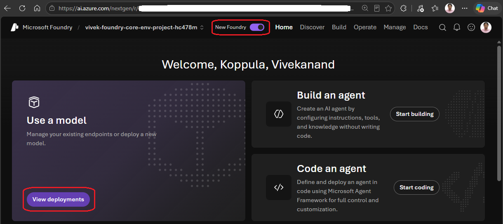
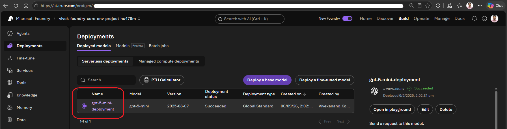
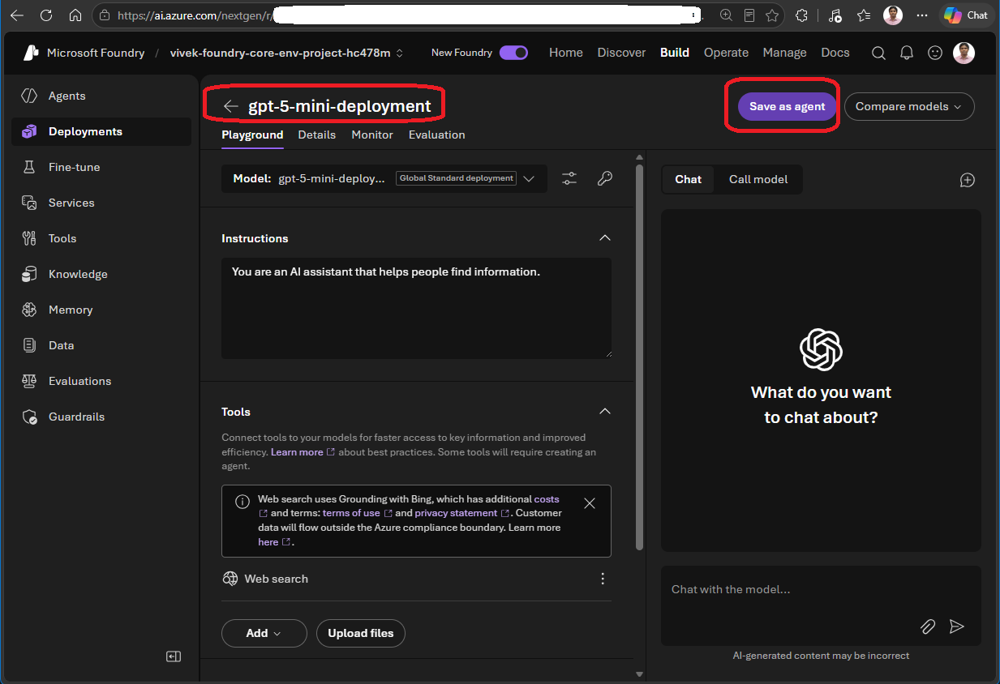
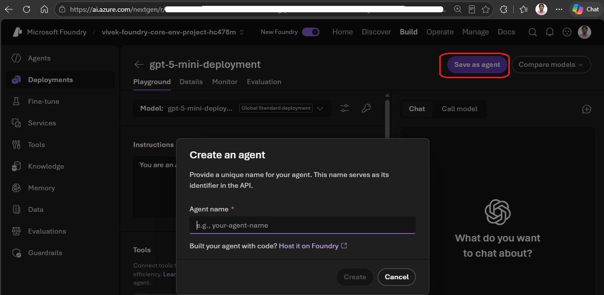
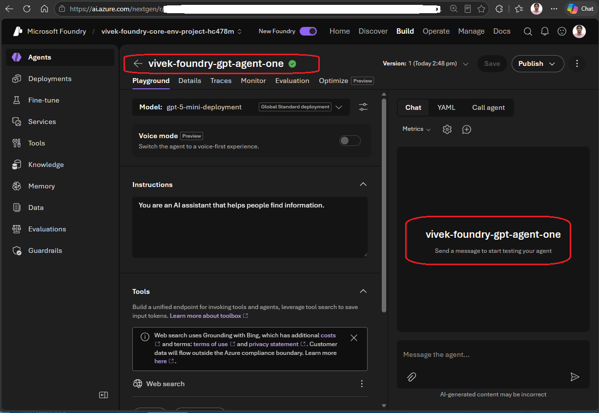

# 1. Define required providers
```hcl
terraform {
  required_version = ">= 1.9.0"
  required_providers {
    azurerm = {
      source  = "hashicorp/azurerm"
      version = "~> 4.0"
    }
  }
}

provider "azurerm" {
  features {}
}
```

# 2. Resource Group

```hcl
resource "azurerm_resource_group" "foundry_rg" {
  name     = "rg-microsoft-foundry-prod"
  location = "East US"
}
```

# 3. Microsoft Foundry Core Resource (Cognitive Services Account)

```hcl
resource "azurerm_cognitive_account" "foundry_resource" {
  name                = "vivek-foundry-core-env-${random_string.rg_suffix.result}"
  location            = azurerm_resource_group.foundry_rg.location
  resource_group_name = azurerm_resource_group.foundry_rg.name
  kind                = "AIServices" # https://registry.terraform.io/providers/hashicorp/azurerm/latest/docs/resources/cognitive_account#kind-1
  sku_name            = "S0"         # https://registry.terraform.io/providers/hashicorp/azurerm/latest/docs/resources/cognitive_account#sku_name-1

  # CRITICAL: This flag exposes project management capabilities for Foundry
  project_management_enabled = true

  # A unique subdomain is mandatory for custom API routing
  custom_subdomain_name = "vivek-foundry-core-env-subdomain-${random_string.rg_suffix.result}"

  network_acls {
    default_action = "Allow"
  }

  identity {
    type = "SystemAssigned"
  }
}
```
# 4. Model Deployment

```hcl
resource "azurerm_cognitive_deployment" "gpt5_mini_deployment" {
  name                 = "gpt-5-mini-deployment"
  cognitive_account_id = azurerm_cognitive_account.foundry_resource.id

  model {
    format  = "OpenAI"
    name    = "gpt-5-mini" # Specific Azure OpenAI model identifier
    version = "2025-08-07" # Replace with your targeted API version string
  }

  sku {
    name     = "GlobalStandard" # Standard or GlobalStandard tier for mini models
    capacity = 100              # Allocated Tokens Per Minute (TPM) in thousands
  }

  rai_policy_name = "Microsoft.Default"
}
```


# 4. Microsoft Foundry Project
```hcl
resource "azurerm_cognitive_account_project" "foundry_project" {
  name                 = "vivek-foundry-core-env-project-${random_string.rg_suffix.result}"
  cognitive_account_id = azurerm_cognitive_account.foundry_resource.id
  location             = azurerm_resource_group.foundry_rg.location
  description          = "Example cognitive services project"
  display_name         = "Foundry Project Example"

  identity {
    type = "SystemAssigned"
  }

  tags = {
    Environment = "test"
  }
}
```

# 5. Now login to ai.azure.com

First Login to ai.azure.com. You will be take to the following. Select resources.



You can see the project as below. Select that.



Now the project is selected. Click Deployements button.



Now you can notice in the deployments, click that. 



The model becomes available inside your project. GPT 5 Mini is available inside the project. At this point, you'll see a button called Save As Agent. Select that button

This is an important step. When you click Save As Agent, you are no longer just experimenting with a model. You are creating a named agent that can be reused across your project and accessed via the API.



Give it a name, a clear descriptive name. This name becomes the agent's identifier in Foundry and in your code later on.



What this means in practice is simple but powerful. The deployed model is now wrapped with instructions, tools, knowledge, memory, and guardrails. The agent becomes a reusable, production-ready component. And this is the object you'll actually call from your applications, workflows, or APIs. So think of it like this. Deploying a model makes it available.



Saving it as an agent turns it into something you can build real systems with. This is the moment where a model becomes an agent. And here in Foundry, you can customize your agent by setting clear instructions, adding tools it can call, grounding it with knowledge, enabling memory, and applying guardrails, shaping how the agent thinks, acts, and behaves in real-world scenarios.


# 6. Trouble shooting. 

Check Available Versions in Your RegionRun the Azure CLI command below to verify exactly which versions and SKUs of gpt-5-mini are supported in your deployment region (e.g., eastus):

```powershell
az cognitiveservices model list --location southindia --query "[?model.name=='gpt-5-mini'].{version:model.version, skus:join(',', model.skus[].name)}"  --output table
```

# 7. Reference

https://registry.terraform.io/providers/hashicorp/azurerm/latest/docs/resources/cognitive_account


